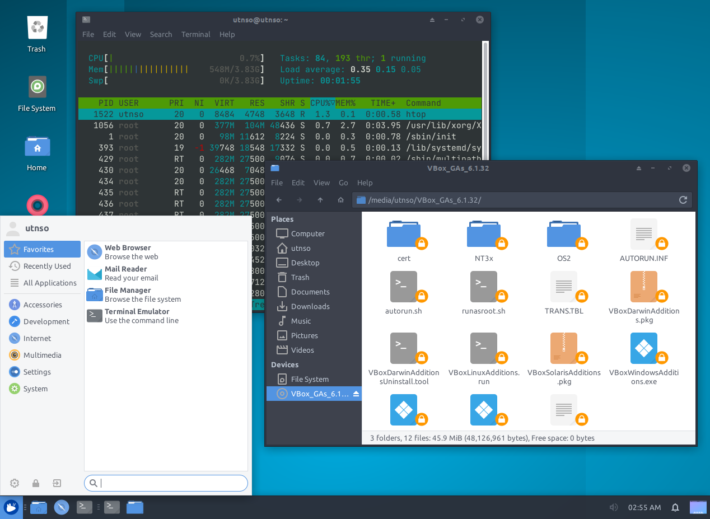

# SisOp VMs - Work In Progress --> 2c2022

> Este repositorio contiene scripts y recursos que estan siendo testeados y NO SE RECOMIENDA SU UTILIZACION. No se brindará soporte para estos scripts hasta que no se encuentren liberadas las VMs 6.0

Este repositorio contiene los archivos para generar el ambiente de la máquina virtual de Sistemas Operativos UTN FRBA en cualquier instalación de Ubuntu (se recomienda partir de una instalanción limpia de Ubuntu Server)

Este tema esta basado en la creación de [Agustin Ranieri](https://github.com/RaniAgus/xfce-theme) agregando los paquetes necesarios para poder servir como entorno de desarrollo del trabajo práctico.



1. Instalar los paquetes de la VM server solamente

```bash
wget -qO- https://raw.githubusercontent.com/sisoputnfrba/entorno-vms/main/base-server.sh | bash -x
reboot
```

2. Instalar el entorno gráfico

```bash
wget -qO- https://raw.githubusercontent.com/sisoputnfrba/entorno-vms/main/interfaz-grafica.sh | bash -x
xfce4-session-logout --logout
```

3. Instalar el tema

```bash
wget -qO- https://raw.githubusercontent.com/sisoputnfrba/entorno-vms/main/theme.sh | bash -x
xfce4-session-logout --logout
```

